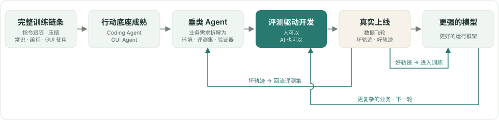
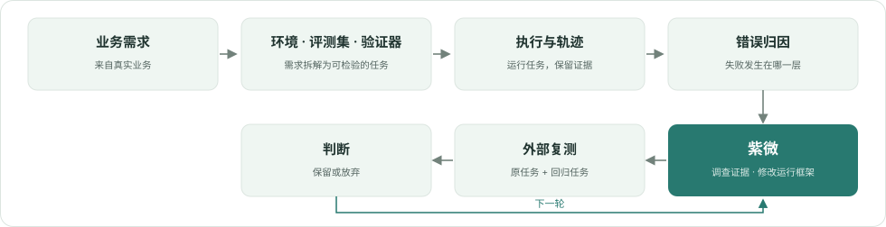

<div align="center">

# 紫微 · Kochab

**把真实业务的失败，变成智能体工作方式的改进。**

[](https://www.python.org/)
[](LICENSE)

**中文** · [English](README_EN.md)

[核心认知](#核心认知) · [局部循环](#紫微建模的局部循环) · [三层结构](#三层结构) · [快速开始](#快速开始) · [开发](#开发)

</div>

紫微是评估驱动开发的参考实现：一份方法论、一层参考抽象、一套供智能体驱动的动态技能工具。

## 核心认知

智能体如何拓展大语言模型的能力边界？答案是下面这个完整的闭环。

**前提一：行动底座成熟。** 指令跟随、压缩、常识任务、编程、GUI 使用——这些能力经过完整的训练链条进入模型。coding agent 与 GUI agent 在此时此刻成熟，成为可靠的行动底座。

**前提二：闭环被观测到。** 在这些能力形成的过程中，我们观测到模型扩展能力边界的固定路径：能力先被组织进运行框架，经评测驱动迭代变得可靠，验证过的方法再经训练回到参数。

**推导：垂类 Agent 的时机到了。** 把业务需求拆解为任务环境、评测集与验证器，开发就变成评测驱动开发。领域的基本能力由中间训练提供；在此之上，运行框架（harness）经这条路径打磨成型。

**落点：人能参与的开发，AI 也能。** 评测驱动开发一直由人类工程师执行；但读证据、查环境、改框架、看复测，没有一件是人独有的工作。让 AI 参与这种开发，就是紫微的落点。

**飞轮：上线之后。** 真实使用带来两类数据，构成自我加强的飞轮。坏轨迹（bad case）回流评测集，成为下一轮迭代的依据；好轨迹经验证进入训练，让有效方法成为模型参数——评测设施（可重置环境、工具、验证器）甚至可以直接复用为强化学习设施。两条回路互相作用。

<p align="center">
  <picture>
    <source media="(prefers-color-scheme: dark)" srcset="docs/assets/capability-cycle.zh.dark.svg">
    
  </picture>
</p>

完整论述见[《智能体如何扩展大语言模型的能力边界》](docs/reference/capability-cycle.pdf)。

## 紫微建模的局部循环

在完整循环中，紫微只切出一段来建模：**错误归因之后，运行框架如何被修改**。

<p align="center">
  <picture>
    <source media="(prefers-color-scheme: dark)" srcset="docs/assets/local-loop.zh.dark.svg">
    
  </picture>
</p>

为什么只切这一段？

- 外层的任务环境、评测与归因，开源世界已有很好的实践，没有必要重做；
- 紫微内部的工作同样乏善可陈；
- 它真正提供的是一个**认知性的改变**——评测驱动开发的设计指导与最佳实践。

因此，对上下文中的环境、评测与归因，只建模、不实现。

## 三层结构

| 层次 | 提供什么 | 入口 |
| --- | --- | --- |
| 思想 | 核心认知与紫微的定位 | [SKILL.md](SKILL.md) · [参考文档](docs/reference/capability-cycle.md) |
| 参考抽象 | 局部循环的领域模型、接口与一轮迭代 | [model](src/kochab/model/__init__.py) · [port](src/kochab/port/__init__.py) · [loop.py](src/kochab/loop.py) · [迁移指南](docs/migration.md) |
| 本地工具 | 为你的智能体提供动态技能系统的标准化接口 | [本地工具](docs/local-tools.md) · [CLI](src/kochab/local/cli.py) |

前两层已由前两节交代；第三层与完整的评测驱动开发关系不大，本质上是一个**动态技能系统优化器**：

- 用你手头的编程智能体，优化一个 skill；
- 复用本地智能体的 LLM 与 harness，调查与修改由智能体完成；
- `kochab` 命令行为智能体提供动态技能系统的标准化接口，整轮由智能体驱动。

## 快速开始

仓库根目录就是 `kochab` 技能，包含三层内容。在需要使用它的项目目录中，将本地 Kochab 仓库安装到你使用的智能体：

```sh
npx skills add /path/to/kochab --skill kochab --copy
```

在自己的技能上跑一轮——对正在使用的编程智能体说一句自然语言：

```text
使用 kochab 技能，优化 my-skill。
```

智能体自己决定读什么、改什么、怎么验证，全程驱动 `kochab` 命令行完成调查、修改、结算与交付。

## 开发

```sh
python -m pip install -e .
```

## 许可

[MIT](LICENSE) © 2026 hxaxd
