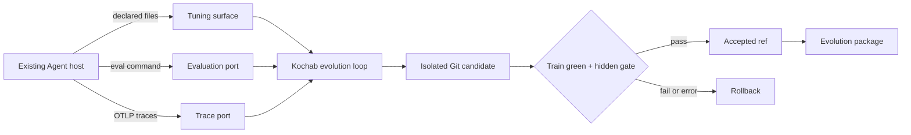

# Kochab

[](https://github.com/hxaxd/kochab/actions/workflows/ci.yml)
[](https://www.python.org/)
[](LICENSE)

**Autonomous Agent-harness evolution from evals and OTLP traces, inside a frozen and reversible boundary.**

Kochab connects to an existing Agent through three small contracts:

- a **tuning surface**: prompt, skill, tool, or workflow files it may change;
- an **evaluation port**: a deterministic command that scores a materialized candidate;
- a **trace port**: OpenTelemetry traces carrying runtime failures and feedback.

It then runs a red → green → refactor loop in an isolated Git work copy. A candidate
is accepted only after the complete train suite passes and a hidden holdout gate does
not regress. Kochab never writes directly to the host's production files; it exports a
reviewable evolution package containing the diff, evidence, scores, and rationale.

> [!IMPORTANT]
> Kochab is an experimental v0.1 research prototype. The end-to-end loop works, but
> the API is not stable and there is no production deployment or multi-tenant control
> plane. See [implementation status](docs/implementation-status.md) for the exact boundary.

## Why Kochab?

Most prompt optimizers own the optimization algorithm or require a particular Agent
framework. Kochab keeps the optimization policy in the model and places framework
specifics behind a minimal files + CLI + OTLP boundary.



The model may diagnose and edit only the declared surface. It cannot access a shell,
the holdout catalog, the evaluator implementation, or arbitrary host files.

## What works today

- Read-only discovery Agent that drafts and validates a host binding.
- Frozen onboarding seal over the binding, tunable source, evaluator dependencies,
  rubric, and case catalog.
- Transactional accepted-version management with recovery after model, gate, or state
  failures.
- Persistent daemon mode that receives OTLP and starts rounds from new failure or
  feedback evidence.
- Evolution packages containing the accepted diff, before/after train scores, hidden
  gate result, evidence references, failure categories, and refactor account.
- A deterministic [`toy-desk`](examples/toy-desk) host covering the complete lifecycle.

The end-to-end test starts `toy-desk` with 0/10 train cases passing, applies a
generalized policy refactor, reaches 10/10, passes all 6 hidden cases, and verifies that
the exported package records `before: 0.0` and `after: 1.0`.

## Interoperability

### Agent traces

Kochab accepts OTLP/HTTP protobuf, JSON, gzip-compressed JSON, and OTLP JSON/JSONL
files. It projects:

- OpenTelemetry trace/span identity, parentage, status, resources, attributes, events,
  inputs, and outputs;
- OpenTelemetry GenAI operations such as `invoke_agent`, `invoke_workflow`, `plan`,
  and `execute_tool`;
- OpenInference span kinds, annotations, and evaluations;
- `gen_ai.evaluation.result` events and Braintrust score attributes.

Unknown attributes and events are retained because the OpenTelemetry GenAI Agent
conventions are still marked development.

### Evaluation results

| `eval.format` | Compatible output |
|---|---|
| `kochab` | Native JSON with host-defined `passed` |
| `jsonl` | One normalized sample per line |
| `promptfoo` | Promptfoo v3 JSON |
| `junit` | pytest, DeepEval, and other JUnit XML producers |
| `inspect` | Inspect JSON logs; `.eval` through an installed `inspect-ai` package |

Library-first evaluators such as Ragas, DSPy, GEPA, MLflow, or custom judges can stay
in their own runtime and expose a thin command that writes native JSON/JSONL or JUnit.
Kochab does not pretend to embed those frameworks.

See [interoperability details](docs/interoperability.md).

## Quick start

Requirements: Python 3.11+, Git, and an OpenAI-compatible chat-completions endpoint
with tool calling.

```bash
git clone https://github.com/hxaxd/kochab.git
cd kochab
python -m pip install -e ".[dev]"
python -m pytest -q
```

Configure the endpoint using standard environment variables. `OPENAI_BASE_URL` is
optional when using OpenAI directly.

```bash
export OPENAI_API_KEY="..."
export OPENAI_BASE_URL="https://your-endpoint.example/v1"
export OPENAI_MODEL="your-tool-calling-model"
```

Run the bundled closed-loop example:

```bash
kochab onboard examples/toy-desk --reset-state --freeze
kochab run examples/toy-desk
kochab gate examples/toy-desk
kochab export examples/toy-desk --out evolution-pack
```

Or point the read-only discovery Agent at another host:

```bash
kochab discover path/to/agent-host
# Review kochab-host.draft.yaml, then save it as kochab-host.yaml.
kochab onboard path/to/agent-host --freeze
kochab daemon path/to/agent-host
```

Command-line `--model` and `--base-url` values override their environment equivalents.

## Host binding

```yaml
surface:
  units:
    - id: system
      category: knowledge
      path: surface/SYSTEM.md
      format: markdown

eval:
  command: ["{python}", "eval/run.py"]
  list_args: ["--list"]
  run_args: ["--surface-dir", "{surface_dir}", "--cases", "{case_ids}"]
  criteria_path: eval/CRITERIA.md
  cases_path: eval/cases.json
  dependency_paths: [eval/run.py]
  format: kochab
  pass_threshold: 1.0

trace:
  kind: otlp-json
  path: traces/otel.jsonl

gate:
  holdout_ids: [hidden-1, hidden-2]
```

Evaluation commands are argument arrays, never shell strings. `{surface_dir}` points
to an isolated materialization of the requested Git version. Result-producing
frameworks may also use `{result_path}` or `{result_dir}` with `result_glob`.

## Acceptance invariants

1. Every round starts from `refs/kochab/accepted`.
2. Any surface mutation invalidates prior train evidence.
3. Acceptance requires a complete, current, host-passed train evaluation.
4. Hidden cases are absent from model-visible catalogs, gold answers, runs, and tools.
5. The hidden gate exposes only aggregate pass/fail information to the model.
6. Errors, unfinished rounds, and gate regressions restore the accepted version.
7. Export always reads the accepted ref, never an abandoned candidate.

## Project layout

```text
src/kochab/
├── contracts/       # TuningSurface, EvalPort, TracePort, and normalized models
├── adapters/        # Git files, eval runners/parsers, OTLP decoding and semantics
├── core/            # Minimal model loop, tools, schemas, and evaluation snapshots
├── gate/            # Hidden holdout gate
├── discovery.py     # Read-only binding discovery
├── onboarding.py    # Port probes, baselines, and frozen seal
├── daemon.py        # Persistent evidence cursor and evolution trigger
├── otlp_receiver.py # OTLP/HTTP receiver
└── export.py        # Accepted evolution package
```

## Documentation

- [Implementation status and roadmap](docs/implementation-status.md)
- [Interoperability matrix](docs/interoperability.md)
- [Chinese design document](docs/design.zh-CN.md)
- [Contributing](CONTRIBUTING.md)
- [Security policy](SECURITY.md)

## License

[MIT](LICENSE) © 2026 苏紫辰
