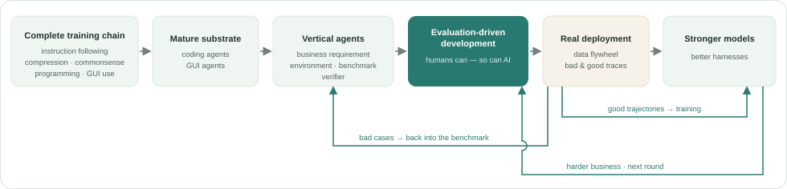
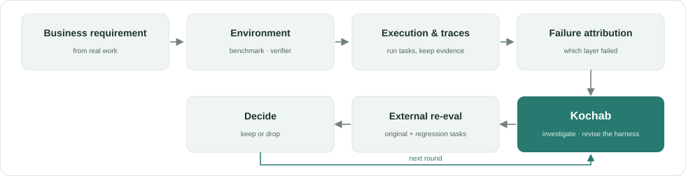

<div align="center">

# Kochab · 紫微

**Turn real task failures into improvements in how an agent works.**

[](https://www.python.org/)
[](LICENSE)

**English** · [中文](README.md)

[Core idea](#the-core-idea) · [Local loop](#the-local-loop-kochab-models) · [Three layers](#three-layers) · [Quick start](#quick-start) · [Development](#development)

</div>

Kochab is a reference implementation of evaluation-driven development: a methodology, a layer of reference abstractions, and a set of agent-driven dynamic-skill tools.

## The core idea

How do agents extend the capability boundary of large language models? The answer is the complete loop below.

**Premise one: the action substrate is mature.** Instruction following, compression, commonsense tasks, programming, GUI use—these abilities entered the model through the complete training chain. Coding agents and GUI agents are, at this very moment, mature enough to be a reliable substrate for action.

**Premise two: the loop has been observed.** As these abilities formed, a fixed path was observed along which a model extends its boundary: capability is first organized into a harness, made reliable through eval-driven iteration, and the verified methods then return to model parameters through training.

**Derivation: the time for vertical agents has come.** Decompose a business requirement into a task environment, a benchmark and a verifier, and development becomes evaluation-driven development. Mid-training supplies the domain foundation; on top of it, the harness is honed along this path.

**Landing point: what humans can develop, AI can too.** Evaluation-driven development has been performed by human engineers—but of reading evidence, probing environments, revising harnesses and checking re-runs, none is human-only work. Letting AI take part in this development is where Kochab lands.

**Flywheel: after deployment.** Real usage yields two kinds of data that form a self-reinforcing flywheel. Bad cases flow back into the benchmark as the basis for the next iteration; good trajectories, once verified, enter training and carry effective methods into model parameters—the evaluation infrastructure (resettable environments, tools, verifiers) can even be reused directly as reinforcement-learning infrastructure. The two loops interact with each other.

<p align="center">
  <picture>
    <source media="(prefers-color-scheme: dark)" srcset="docs/assets/capability-cycle.en.dark.svg">
    
  </picture>
</p>

For the full argument, see [How agents extend the capability boundary of large language models](docs/reference/capability-cycle.pdf) (Chinese).

## The local loop Kochab models

Within the full cycle, Kochab models a single segment: **after failure attribution, how the harness gets revised**.

<p align="center">
  <picture>
    <source media="(prefers-color-scheme: dark)" srcset="docs/assets/local-loop.en.dark.svg">
    
  </picture>
</p>

Why only this segment?

- The outer layers—task environments, evaluation, attribution—already have excellent open-source practice; there is no need to redo them.
- Kochab's internal work is similarly unremarkable.
- What it truly offers is a **shift in understanding**—the design guidance and best practice of evaluation-driven development.

So the surrounding context—environments, evaluation, attribution—is modeled but never implemented.

## Three layers

| Layer | Provides | Entry |
| --- | --- | --- |
| Ideas | The core understanding and Kochab's position | [SKILL.md](SKILL.md) · [Reference essay](docs/reference/capability-cycle.md) |
| Reference abstractions | Domain model, interfaces and one iteration of the local loop | [model](src/kochab/model/__init__.py) · [port](src/kochab/port/__init__.py) · [loop.py](src/kochab/loop.py) · [Migration guide](docs/migration.md) |
| Local toolkit | A standardized dynamic-skill-system interface for your own agent | [Local tools](docs/local-tools.md) · [CLI](src/kochab/local/cli.py) |

The first two layers were covered by the two sections above; the third is not closely tied to full evaluation-driven development—essentially a **dynamic skill system optimizer**:

- your local coding agent optimizes one skill;
- it reuses that agent's own LLM and harness—investigation and revision belong to the agent;
- the `kochab` CLI gives your agent a standardized dynamic-skill-system interface; the whole round is agent-driven.

## Quick start

The repository root is the `kochab` skill and contains all three layers. From the project where you want to use it, install the local Kochab repository for your coding agent:

```sh
npx skills add /path/to/kochab --skill kochab --copy
```

Run a round on your own skill—say one sentence of natural language to the coding agent you are using:

```text
Use the kochab skill to optimize my-skill.
```

The agent decides for itself what to read, what to change and how to verify, driving the `kochab` CLI throughout investigation, revision, settlement and delivery.

## Development

```sh
python -m pip install -e .
```

## License

[MIT](LICENSE) © 2026 hxaxd
