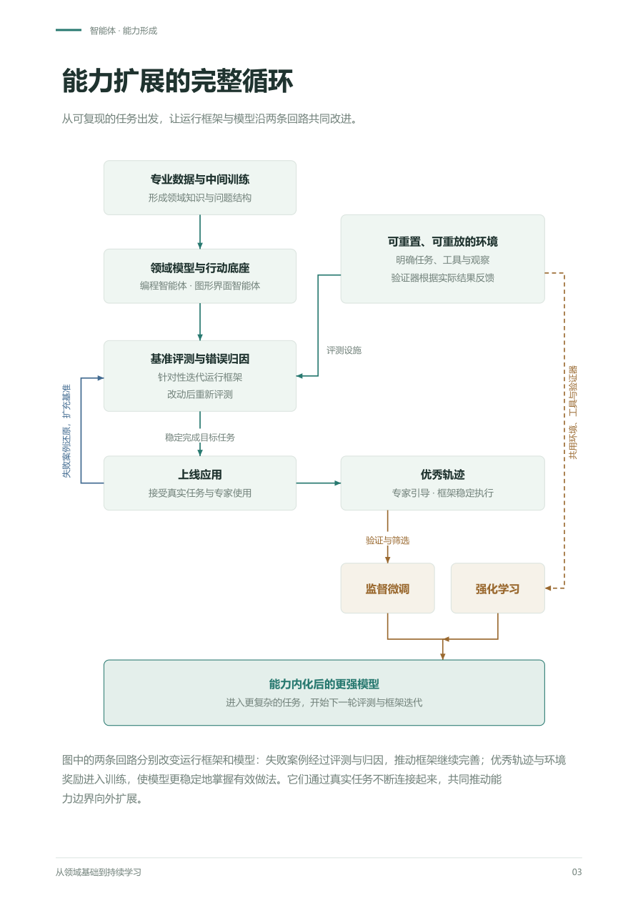

# 智能体如何扩展大语言模型的能力边界

来源：[2026-09-10 原始 PDF](capability-cycle.pdf)。前两页正文按段落转录，第三页流程图保留原图。

智能体是大语言模型扩展能力边界的核心环节，因为它能够把一个模型尚不能独立、稳定完成的领域任务，逐步转化为可执行、可评价、可反复学习的过程。理解这件事，需要把领域训练、运行框架、评测环境和真实使用放进同一个循环：它们共同决定一种能力如何被引导出来，如何变得稳定，又如何进入下一代模型的参数。

## 先形成领域基础，再把潜在能力组织起来

进入一个新领域，首先需要大量专业数据。通过中间训练，模型逐渐熟悉这个领域中的对象、概念、关系和常见问题，形成进一步完成任务所需的基础能力。在此基础上，可以借助编程智能体和图形界面智能体作为通用行动底座，让模型通过代码、软件界面和工具接触真实业务。领域数据帮助它理解要做的事，行动底座则让这种理解有机会产生实际结果。

这时，模型参数中往往已经隐含了完成任务所需的许多知识和逻辑，但它未必会在恰当的时刻调动它们，更未必能把它们组织成稳定的工作过程。运行框架的作用，就是通过补充知识、提供经验、接入工具和安排流程，把这些潜在能力引导出来。模型可能已经会做每一个局部步骤，却不能稳定地完成整件事；框架先替它维持步骤之间的联系，让通用能力能够在具体任务里发挥作用。

## 把业务变成可以反复检验的环境

要系统地弥补能力鸿沟，还需要一套可反复重置、重放的确定性环境。环境能够恢复到明确的初始状态，外部依赖和关键条件能够被控制，同一个问题才可以从同一起点反复尝试。这里固定的是执行条件和可复现的状态变化；模型仍然可以作出不同选择，而不同选择的后果能够被观察和比较。这样，开发者才有办法判断一次改善究竟来自哪里。

围绕这个环境，还要明确任务是什么、模型能够使用哪些工具、通过什么方式观察状态，以及最终结果怎样被验证。把一组有代表性的任务、初始条件和验证器组织起来，就形成了基准测试。验证器根据实际结果给出反馈，使“完成任务”成为可以检验的事实。这套设施既让开发有了明确目标，也为之后的训练准备了可以尝试、可以评分的工作场地。

## 通过错误归因迭代运行框架

有了基准测试，框架开发就可以围绕评测展开：让智能体运行任务，记录它看到的上下文、采取的动作、工具返回的结果，以及环境最终发生的变化。出现失败时，需要保留足够的信息来还原问题，再判断失败究竟发生在哪一层。缺少领域知识、遗漏关键观察、选择了错误的方法、工具执行异常，或者验证标准本身有问题，都对应着不同的改进方向。

错误归因把一次失败变成了具体的开发任务。缺少知识，就补充材料或继续训练；不会组织行动，就调整经验、工具和流程；执行条件有缺陷，就修改环境设施。每次改动之后，都回到可复现的任务中重新评测，确认原来的问题得到解决，也没有破坏其他已经能完成的工作。这样逐步得到的，是经过评测驱动开发、能够稳定引导模型发挥领域能力的运行框架。

## 上线以后，数据沿两条回路流动

当系统已经能在目标范围内稳定工作，就可以上线接受真实使用。真实任务会带来预先设计的测试没有覆盖到的组合，也会暴露新的能力缺口。第一条数据回路因此围绕失败案例展开：把线上问题还原成可重复运行的任务，补入基准测试，再经过评测、错误归因和针对性修改，继续迭代运行框架。产品遇到的问题，由此持续变成下一轮开发的依据。

第二条数据回路围绕优秀轨迹展开。它们既可以来自专家在使用过程中对模型的引导，也可以来自运行框架已经能够稳定引导出来的成功执行。专家的关键提醒、模型取得的观察、采取的动作和最终结果，共同留下了一条可学习的路径。经过质量验证、筛选和整理，这些轨迹可以用于监督微调，让模型在相似情境下更容易自行作出那些有效选择。

这两条回路相互促进。失败案例帮助我们找到框架还应该补什么，框架的改进又让更多任务能够成功完成，从而产生更多有价值的轨迹。轨迹进入训练后，模型对外部引导的依赖可以减少，原先由框架反复提醒的做法，逐渐成为模型更稳定的行为。框架积累的工作方法，就这样获得了一条进入模型参数的路径。

## 评测设施也能成为强化学习设施

同一套任务环境，还能支持强化学习。评测已经要求环境可重置、工具可执行、状态可观察、结果可验证，这些设施也正好支持模型反复探索并获得奖励。复用它们，可以让模型从尝试结果中调整行为，提高那些原本低概率的优秀选择及其组合出现的概率。监督微调把已经找到的好路径交给模型学习，强化学习则让模型继续探索，并把有效行为变得更常见。

因此，任务和验证器的设计也在参与塑造模型能力：它们决定什么值得尝试，以及什么结果会被当作成功。训练与评测可以共用基础设施，同时保留未参与训练和框架优化的独立任务，检验学到的方法能否迁移到新的问题。持续加入真实使用暴露的新情况，才能让这个循环不断扩大模型能够稳定处理的任务范围。

## 能力在循环中进入模型

整个过程可以概括为：专业数据形成领域基础，运行框架把潜在能力组织成实际工作，评测与错误归因推动框架改进，真实使用持续提供失败案例和优秀轨迹，监督微调与强化学习再把有效做法转化为模型更稳定的能力。更强的模型能够面对更复杂的任务，新的能力缺口又成为下一轮开发和训练的起点。

进入模型参数的是理解问题、选择方法和组织行动的能力；工具、实时资料与执行环境继续由外部系统提供。智能体之所以处在扩展模型能力边界的核心位置，就在于它把真实业务与模型训练接成了一个可持续推进的过程。开发一个领域智能体，既是在让今天的模型完成新的工作，也是在构造下一代模型学会这些工作所需的任务、条件和数据。

## 能力扩展的完整循环

图中评测与强化学习共用可重置的环境、工具和验证器。上线后的失败回到基准评测与归因；经过验证筛选的优秀轨迹进入监督微调。训练后的更强模型面对更复杂的任务，开始下一轮开发。
