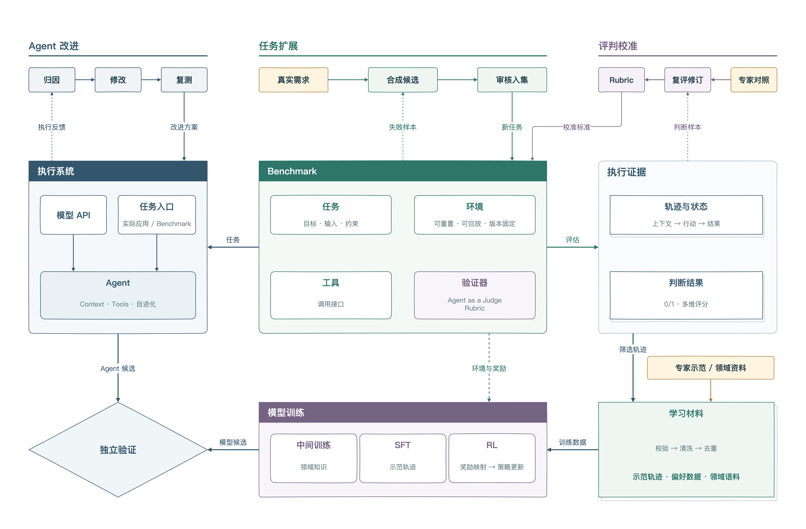

# 智能体如何扩展大语言模型的能力边界

2026-09-27 修订 · [PDF 版](capability-cycle.pdf)

智能体是大语言模型扩展能力边界的核心环节，因为它能够把一个模型尚不能独立、稳定完成的领域任务，逐步转化为可执行、可评价、可反复学习的过程。理解这件事，需要把领域训练、运行框架、评测环境和真实使用放进同一个循环：它们共同决定一种能力如何被引导出来，如何变得稳定，又如何进入下一代模型的参数。

预训练让模型从大量数据中学习知识与抽象模式；中间训练继续建立领域基础；监督微调和强化学习进一步塑造完成任务的行为。模型上线以后，新的真实需求仍然会带来能力缺口。Agent 将这些需求组织成可以执行和验证的过程，也由此为下一轮训练积累材料。

这条链路中，连接模型使用与模型训练的是一套持续生产任务、证据和学习材料的系统。它不属于某一个模型，也不只是一套 Agent 框架：更换模型或框架以后，任务仍然可以运行，经验仍然可以被检验，经过整理的数据仍然可以参与训练。本文要说明的，就是这套系统怎样运转，以及人类的知识和判断怎样通过它进入模型。

## 先形成领域基础，再把潜在能力组织起来

进入一个新领域，首先需要相应的专业知识和数据。当现有模型的领域基础不足时，可以通过中间训练，让模型逐渐熟悉这个领域中的对象、概念、关系和常见问题，形成进一步完成任务所需的基础能力。在此基础上，可以借助编程智能体和图形界面智能体作为通用行动底座，让模型通过代码、软件界面和工具接触真实业务。领域数据帮助它理解要做的事，行动底座则让这种理解有机会产生实际结果。

这时，模型参数中往往已经隐含了完成任务所需的许多知识和逻辑，但它未必会在恰当的时刻调动它们，更未必能把它们组织成稳定的工作过程。运行框架的作用，就是通过补充知识、提供经验、接入工具和安排流程，把这些潜在能力引导出来。模型可能已经会做每一个局部步骤，却不能稳定地完成整件事；框架先替它维持步骤之间的联系，让通用能力能够在具体任务里发挥作用。

这里的运行框架，也就是 Harness，是模型在一次次调用之间持续工作的条件。它安排哪些信息进入上下文，保存哪些经验，提供哪些工具，并在工具返回以后继续调用模型。一个模型 API 接上这些设施，就可以形成 Agent；Agent 不必是另一个已经封装好的产品。模型负责理解与选择，Harness 让这些选择能够连续地作用于环境。

这也解释了为什么系统能力可以先于模型参数发生变化。让 Agent 先查证再写作、保留尚未完成的事项，或者在修改代码以后主动运行测试，都可能改善结果，而模型权重完全没有改变。Anthropic 关于长任务 Harness 的实践就展示了这类改进：任务拆分、跨会话信息交接和独立评判共同帮助模型完成更长的工作。这里改善的是整个系统的表现，不能直接等同于模型本身已经学会了这些做法。[1](https://www.anthropic.com/engineering/harness-design-long-running-apps)

## 把业务变成可以反复检验的环境

要系统地弥补能力鸿沟，可以先把一部分业务放进可反复重置、重放的受控环境。环境能够恢复到明确的初始状态，外部依赖和关键条件能够被控制，同一个问题才可以从同一起点反复尝试。这里固定的是执行条件和可复现的状态变化；模型仍然可以作出不同选择，而不同选择的后果能够被观察和比较。这样，开发者才有办法判断一次改善究竟来自哪里。

围绕这个环境，还要明确任务是什么、模型能够使用哪些工具、通过什么方式观察状态，以及最终结果怎样被验证。把一组有代表性的任务、初始条件和验证器组织起来，就形成了基准测试。验证器根据实际结果给出反馈，使“完成任务”成为可以检验的事实。这套设施既让开发有了明确目标，也为之后的训练准备了可以尝试、可以评分的工作场地。

一个 Benchmark 可以进一步拆成四个部分。**任务**规定目标、约束和交互方式，不必是一段文字，也可以是一个系统，甚至包含另一个智能体。**环境**保存初始条件并承载状态变化，让任务能够从同一起点重新开始。**工具**提供观察与行动的手段，明确智能体能看到什么、能改变什么。**验证器**依据执行过程、实际结果和环境证据作出判断，可以是确定性脚本、人类偏好、LLM，也可以是会调用工具调查的 Agent。

可复现性需要落到具体条件上：固定环境版本、初始状态、seed 和外部依赖后，应尽量使相同动作序列产生可比较的环境变化。模型仍然可能采取不同动作；如果任务包含实时系统或其他智能体，就需要明确哪些内容可以冻结或回放，哪些随机性需要通过重复运行观察。

工具还决定了任务是否真的可做。要求 Agent 核对原文，就必须允许它读取原文；要求它修复软件，就必须提供修改和运行软件的手段。工具的能力需要覆盖任务要求的行动空间，返回的信息也要足以支持下一步判断。缺少必要工具造成的失败，不能直接算作模型不具备相应能力。

验证器把执行留下的证据转化为判断，但判断不必只有一个总分。测试是否通过，可以返回 0 或 1；一份报告的准确性、覆盖度和可读性，可以分别给出结果；某项证据是否存在，也可以直接回答并指出位置。保留这些维度，后续归因才知道需要改什么。把它们汇总成分数，是比较候选或用于训练时的另一项选择。

Rubric 规定的是评判标准，Judge 负责执行这些标准。对于论文总结，“总结得好不好”过于含糊；是否准确复述结论、是否保留适用条件、是否把推测写成事实，才是可以逐项检查的要求。Agent as a Judge 还可以打开原文、核对引用并寻找反例，让判断建立在证据上。Rubric 既可以包含每道任务特有的要求，也可以包含所有任务共用的标准。[2](https://arxiv.org/html/2411.15594v6)

## 从真实需求冷启动 Benchmark

冷启动从明确需求开始：希望增加什么能力，在哪些条件下使用，什么结果算完成，有哪些不能违反的约束。随后围绕这些要求建立第一批有代表性的任务，覆盖常见情况、关键边界和已知失败，并为每个任务配齐初始条件、工具与验证方式。第一版需要评测要素齐全，不要求一次穷尽所有场景。

最小的起点甚至可以只有一道题。例如，希望论文阅读助手交付一份可核查的总结，就选一篇确实要读的论文，保存原文，写清交付要求，提供阅读工具，再规定如何核查结论与引用。这道题首先表达一个真实需求。围绕它把执行与验证接起来，比先收集大量题目、之后才发现无法判断结果更有用。

先跑一次基线，既看 Agent 的表现，也检查任务能否执行、环境能否恢复、结果能否被验证。保存逐步观察、动作、工具返回及最终状态，失败才有可调查的证据。评测还应明确运行预算和结果的汇总方式；用于开发和选择候选的任务，与最后检验泛化的任务分开，后续真实使用再持续补充新的覆盖。

冷启动也不要求先把每个模块自动化。第一批任务可以由人写，Rubric 可以由人拟定，失败也可以由人阅读轨迹后归因。重要的是让要求、行动、结果和判断能够对应起来。只要这条路径能够运行，后面就可以逐步把出题、评判和修改交给 Agent，并检查它是否接得住原来由人完成的工作。

## 通过错误归因迭代运行框架

有了基准测试，框架开发就可以围绕评测展开：让智能体运行任务，记录它看到的上下文、采取的动作、工具返回的结果，以及环境最终发生的变化。出现失败时，需要保留足够的信息来还原问题，再判断失败究竟发生在哪一层。缺少领域知识、遗漏关键观察、选择了错误的方法、工具执行异常，或者验证标准本身有问题，都对应着不同的改进方向。

错误归因把一次失败变成了具体的开发任务。缺少知识，就补充材料或继续训练；不会组织行动，就调整经验、工具和流程；执行条件有缺陷，就修改环境设施。每次改动之后，都回到可复现的任务中重新评测，确认原来的问题得到解决，也没有破坏其他已经能完成的工作。这样逐步得到的，是经过评测驱动开发、能够稳定引导模型发挥领域能力的运行框架。

一次有效修复还需要变成以后能重复使用的经验。如果论文总结遗漏了实验条件，在当前回答里补上一句话，只修好了这一份结果；把“结论必须附带适用条件”写入工作要求，并让 Agent 在交付前核对原文，才可能改善后续任务。经验可以保存为提示词、上下文组织方法、可检索的记忆或工具流程。它们共同构成 Harness 中积累的能力。

这些经验不只提高成功率，也改变了能够收集到的训练数据。一个裸模型调用可能频繁跳过关键步骤，加入合适的工具和引导后，同一个模型却可能完成原先不稳定的任务。现在留下的轨迹包含了有效的观察、行动及其结果，系统便有机会把已经找到的工作方法交给下一轮训练。

## 把成功执行整理成模型可以学习的材料

监督微调需要的材料，可以从已经验证的执行过程中获得。专家在关键处给出提醒，Harness 安排必要的步骤，Agent 调用工具并完成任务，这些过程都可能留下有价值的示范。训练时，模型学习在类似上下文里作出合适的选择，原先每次都需要外部提醒的行为，才有机会变成更稳定的习惯。

轨迹不能只保留最后的漂亮答案。若模型应该学会查证，就需要保留它在什么情况下决定查证、使用了什么工具，以及拿到什么信息以后改变了结论。训练输入也不能偷偷加入当时尚不可得的证据，否则模型学到的是一个在真实执行中无法复现的过程。哪些步骤来自模型，哪些来自专家纠正，也应当能够分辨。

一次成功不自动意味着整条轨迹都值得学习。结果可能碰巧正确，过程可能包含无效绕路，工具返回也可能有错误。材料需要经过验证、筛选和去重，保留必要的上下文与调用关系，再转换为训练格式。失败后的有效修正、两种方案之间有依据的比较，同样可能成为学习材料。

这类材料生产已经存在于模型研发中。Llama 3 的技术报告描述了多轮合成数据、回答筛选和人工修订；DeepSeek-V3 也使用专门的模型生成训练样本。教师模型与 Agent 驱动的生产可以放进同一条链路理解：当任务需要多步行动时，生成过程延伸到工具和环境中，留下的材料就从回答扩展为执行轨迹。[3](https://arxiv.org/html/2407.21783v3#S4.SS2) [4](https://arxiv.org/html/2412.19437v2#S5.SS1)

生产材料的模型与接受训练的模型，也不必是同一个。即使当前只有一个不可修改权重的模型 API，仍然可以先把任务、环境和轨迹生产运行起来，再把合格材料用于能够训练的模型。需要保持的是任务含义、工具行为和学习目标之间的对应关系，而不是要求整条链路只能使用一个模型。

进入训练的也不只有轨迹。在完成任务时发现并整理出的领域资料，可以用于中间训练；经过验证的示范可以用于 SFT；带有可靠比较依据的数据可以用于偏好优化。这些材料解决的问题不同，需要分别组织。把所有线上记录倒进同一个数据集，不会自动得到更好的模型。

## 评测设施也能成为强化学习设施

同一套任务环境，还能支持强化学习。评测已经要求环境可重置、工具可执行、状态可观察、结果可验证，这些设施也正好支持模型反复探索并获得奖励。复用它们，可以让模型从尝试结果中调整行为，提高那些原本低概率的优秀选择及其组合出现的概率。监督微调把已经找到的好路径交给模型学习，强化学习则让模型继续探索，并把有效行为变得更常见。

从 Benchmark 转为强化学习环境，主要是改变了这些设施的使用方式。模型在任务中采取行动，环境返回状态，验证器给出判断，再由奖励规则把判断转成训练信号。多维结果需要决定如何组合，哪些条件必须满足，哪些改善值得鼓励。Rubric 因而不只影响评测报告，也可能通过奖励影响模型倾向于采取什么行为。

强化学习中的轨迹会随着策略更新而改变。当前模型尝试任务，产生新的轨迹和奖励，训练更新模型，更新后的模型再去尝试。环境和工具承载这个持续的交互过程，而不是只提供一份事先整理好的静态答案。MiMo 开放的 Agentic RL 设施把任务、验证方式、环境镜像和训练代码连接在一起，提供了一个可以对照的工程实例。[5](https://huggingface.co/datasets/XiaomiMiMo/MiMo-V2.6-RL-oss/blob/main/README.md)

因此，任务和验证器的设计也在参与塑造模型能力：它们决定什么值得尝试，以及什么结果会被当作成功。训练与评测可以共用基础设施，同时保留未参与训练和框架优化的独立任务，检验学到的方法能否迁移到新的问题。持续加入真实使用暴露的新情况，才能让这个循环不断扩大模型能够稳定处理的任务范围。

## 能力在循环中进入模型

整个过程可以概括为：专业数据形成领域基础，运行框架把潜在能力组织成实际工作，评测与错误归因推动框架改进，真实使用持续提供失败案例和优秀轨迹，监督微调与强化学习再把有效做法转化为模型更稳定的能力。更强的模型能够面对更复杂的任务，新的能力缺口又成为下一轮开发和训练的起点。

进入模型参数的是理解问题、选择方法和组织行动的能力；工具、实时资料与执行环境继续由外部系统提供。智能体之所以处在扩展模型能力边界的核心位置，就在于它把真实业务与模型训练接成了一个可持续推进的过程。开发一个领域智能体，既是在让今天的模型完成新的工作，也是在构造下一代模型学会这些工作所需的任务、条件和数据。

因此，需要区分两个阶段的改善。调整 Harness，可以在模型不变时提高系统能力；经过训练，有效的行为才可能进入模型参数。第二阶段的结果仍需独立验证，不能用“系统生成了更多成功轨迹”替代“训练后的模型确实变强”。检验时还要说明模型使用了什么工具、上下文和运行预算，才能知道提升来自哪里。

模型变强以后，原有 Harness 也需要重新检查。过去必需的提醒和流程，可能已经可以简化；仍然承担外部信息获取、状态保存和真实操作的部分，则需要继续存在。Anthropic 的 Harness 实践中，更换能力更强的模型后，一些原有补偿步骤可以移除。这说明框架应随模型调整，但不能据此断言某次模型提升必然来自那套框架的训练回流。[1](https://www.anthropic.com/engineering/harness-design-long-running-apps)

图中展示的是这条链路的主要职责。上方改进 Harness、任务和评判标准；中间运行任务并形成证据；下方把材料和环境用于训练，再检验模型与 Agent 候选。图省略了具体调用和发布步骤，实际应用如何进入这条链路，将在后文展开。

到这里，从任务执行到模型训练的通用 Pipeline 就串起来了。但一套能在人的安排下运行的系统，还不等于能自己持续改进。接下来需要分别追问三件事：谁把失败变成有效经验，谁提出下一批值得学习的任务，谁判断新的结果到底好不好。它们决定了这个循环能走多远。

## 第一处难点：让经验持续沉淀到 Harness

这条迭代路径也就是自进化的基础。固定一版 Benchmark 和验证器，先得到基线结果，再根据失败提出有证据的修改假设：哪一步出了问题，为什么认为它是原因，准备改变哪个部分。修改对象可以是提示词、知识材料、工具使用方式或工作流程。保留基线与候选版本，并记录修改理由，才能把一次效果变化与具体改动联系起来。

候选随后回到相同条件下复测，同时检查原来的失败是否改善、已经能完成的任务是否退化，以及是否满足必要的成本或执行约束。证据支持时采纳，效果变差时放弃，证据不足时继续调查。若归因指向环境或验证标准，应先修复相应设施，再用统一条件重建对照，不能把评分标准的变化当作 Agent 的进步。

这些工作可以由人类完成，也可以由智能体读取证据、提出修改并接受复测。后者就是这里所说的 Agent 自进化；具体采用哪种优化方法，可以由领域决定。它首先改善的是系统组织能力和执行任务的方式，经过验证的经验再通过训练进入模型参数。人类也可以在任何一轮提供判断、修正归因或补充要求。

让 Agent 修改自己的提示词，并不自动带来改进。真正有用的是让它读到具体失败、提出可以检验的修改，并接受相同条件下的复测。GEPA 就是一类这样的尝试：从执行轨迹中反思问题，提出并测试提示词更新，再保留有效经验。它证明了部分改进工作可以交给模型完成，但不意味着任意修改都有效，也不意味着模型参数因此发生了变化。[6](https://arxiv.org/abs/2507.19457v2)

人类在这里提供的，往往是对原因和适用范围的判断。一次遗漏可能需要补充上下文，也可能是任务本来就没有说明清楚；为一道题增加的提示词，可能改善同类任务，也可能只是泄露了这道题的答案。把这些情况区分开，才知道应该保存的是通用方法、局部经验，还是根本不该保留的补丁。

要让模型更多地接手这项工作，就要让这些判断也能接受检验。一个关于原因的解释，应当导出具体修改；修改有效，应当在未用于提出它的相关任务上仍有收益；声称某条经验已无必要，也应当通过移除它后的比较来验证。这样积累的 Harness 才能持续产生更好的执行，而这些执行又为模型训练提供更好的材料。

## 第二处难点：让 Benchmark 主动生长

任务既可以由人类设计，也可以由 Agent 合成。出题者根据已有任务、执行轨迹和评测反馈，寻找遗漏的条件、需要联合考虑的信息或尚未覆盖的边界，提出新的挑战。这样，Benchmark 除了接收真实使用的失败，还能主动探索当前 Agent 的能力缺口。

生成候选和接纳任务应当分开。新任务需要明确的要求、可恢复的初始条件和验证依据，并保留来源与设计理由。参考解或取证材料供审核使用，与执行者看到的问题分开。通过制造矛盾、缺失信息或错误标准让模型失败，并不代表找到了有价值的难题；候选要先经过有效性检查，必要时由人类复核。

固定执行者和评分标准，试跑新任务，把结果反馈给出题者，再形成下一轮候选，便构成任务生成与任务求解的对抗循环。难度是否增加，需要由执行证据判断。通过审核的任务进入新版本 Benchmark，原有任务继续保留；参与出题与调优的任务属于开发材料，独立测试仍应隔离。

有价值的新题，需要对应一种值得获得的能力。把论文写得更长，不一定增加了阅读价值；给出结论不同的研究，要求根据实验条件解释差异，才可能暴露另一类阅读缺口。出题者要说明新任务与已有任务的区别，以及这种区别为什么会在真实需求中出现。否则，系统可能生成很多题，却只是在重复同一种考法。

出题本身也可以由一个 Harness 支持。它读取需求、已有任务和失败记录，通过提示词提出候选，再调用工具检查材料与条件。候选进入试跑以后，执行反馈又成为下一轮出题的依据。这里不需要再假设一种完全不同的智能：同样是模型在上下文、工具和反馈支持下完成一项工作，只是这次交付的是任务。

人类仍然经常决定哪些缺口值得追、哪些任务算有效，以及什么难度适合当前阶段。让一个任务变得无法完成很容易，找到可解、有用、又能揭露能力边界的任务则困难得多。模型接手出题以后，需要同时接受有效性与价值的评估；求解者失败，只说明它在这次执行中没有完成任务，不能单独证明出题者做得好。

Benchmark 的增长因此不只是题量增长。新版本应该带来新的覆盖，保留能追踪旧能力的任务，并让不同版本之间的变化可以解释。当新任务继续产生可验证的优秀轨迹，或成为有效的 RL 练习，它才把“发现不会做什么”进一步接到了“让模型学会什么”。

## 第三处难点：让 Rubric 和判断一起变好

任务决定要做什么，Rubric 决定什么结果值得保留。如果标准遗漏了重要条件，系统可能一直优化错误方向。例如，论文总结只按流畅度和完整度评分，模型就可能写出一份很好读、却把相关关系说成因果关系的文章。增加更多生成次数，不能弥补这个标准本身的缺口。

好的 Rubric 需要让关键要求能够被证据支持。对于“没有夸大结论”，可以要求判断者找到总结中的结论句，与原文的实验范围逐项核对。对于“覆盖了核心贡献”，则需要先识别作者的主要主张，再检查总结是否遗漏。标准写得具体以后，Judge 才知道去哪里调查，也更容易说明为什么作出某个判断。

Rubric 仍然不能包办所有验证。能够直接运行的测试，就应当检查实际执行结果；明确的引用位置，可以直接核对；需要综合解释、比较或判断品位的部分，再由人类、LLM 或 Agent 评判。同一任务可以组合这些手段。判断者会调用工具，意味着它能够获得更多证据，并不意味着它的结论天然可信。

Rubric 可以先由模型根据任务生成，再对同一份任务证据独立、并行评判多次，把明显不一致标记为待调查案例。另一轮模型调用负责总结分歧、提出 Rubric 修订，然后重复评判。判断结果未必是数值，一致性也应按任务含义判断。最后仍需人类抽检，既检查被标记的案例，也检查没有被标记的案例；减少不一致，不等于判断已经正确。

要检查判断是否正确，还需要一批有依据的对照案例。可以保留专家的判断及理由，也可以构造只改变关键条件的成对结果，观察评分是否随之变化。比如，在其他内容相同时，删除一项必要的适用条件，关于准确性的评价就应受到影响。这样的检查让我们能够区分：标准缺了要求、Judge 没有取到证据，还是它拿到证据以后仍然判断错了。

人类的品位也可以通过这类案例逐步表达。专家指出哪一份总结更有用、为什么某个遗漏不能接受，再把这些理由整理成标准和对照材料。模型就有机会模仿这些判断，并在新案例上接受检查。对于主观要求，目标通常是更好地表达具体使用者的偏好，而不是制造一套对所有人都正确的分数。

评判能力本身也可以成为改进对象。Meta-Rewarding 的研究把“判断原先的判断”纳入训练，在其指令跟随实验中获得了收益。它提供了一个局部例子：模型可以参与改善评价能力。但增加一层 Judge，并没有自动消除原有偏差，更没有证明整个系统已经能无限自我改进。[7](https://aclanthology.org/2025.emnlp-main.583/)

每次修订 Rubric，都要区分是结果变好了，还是尺子变了。检查 Agent 的提升，应在统一标准下比较候选；检查标准的提升，则要看它能否更准确地区分有依据的好坏案例。修改评分规则以后总分上升，不能直接算作任务能力上升。这是评判校准与执行改进需要分开检验的原因。

## 人类作为教师，具体教了模型什么

人类在这条链路里并不只是标注答案。选择业务需求是在决定学什么，设计任务是在安排练习，修订 Rubric 是在说明什么算好，分析失败是在提供工作方法，筛选轨迹是在选择哪些经验值得模仿。这些工作分别发生在不同模块里，最后共同影响模型会学到什么。

因此，人类知识进入模型的方式比“写示范答案”更广。专家可以不亲自完成整项任务，只在关键处补一个条件、否定一次错误归因，或指出一个被评分忽略的问题。Agent 依据这些指导完成后续探索，形成任务、轨迹或奖励。进入训练的数据看起来由模型生成，其质量仍可能依赖前面由人作出的这些判断。

现阶段这些工作经常由人类主导，一个原因是人类能够把局部结果与真实用途联系起来。模型可以发现两份评分不一致，却未必知道哪份更符合需求；可以写出很多新题，却未必知道哪些值得做。自动生成已经能够承担相当一部分劳动，判断生成物是否有价值，仍然可能需要领域经验和外部证据。

让模型更多地驱动这条链路，需要把人的判断转成可学习、可检验的经验。只保存“这次不行”，下一轮仍然需要重新问人；保存哪里不行、依据是什么、如何验证修正，后续 Agent 才能尝试接手。每接手一项工作，都要观察它是否在新的任务上继续成立，而不是仅仅能复述原有理由。

## 从局部改进走向递归自我改进

递归自我改进，也就是 RSI，关心的是改进能力本身能否进入下一轮改进。Agent 完成更多任务，是工作能力增加；它还能更好地修改 Harness、提出任务、检验结果，并由此帮助后续模型继续变强，才开始形成本文关心的递归关系。更强的求解能力应当继续支持更强的改进能力。

这里的“自己”可以是一套系统，而不必是同一个模型扮演所有角色。求解、出题和评判可以使用不同的模型、工具与环境，训练得到的新版本再替换其中适合更新的部分。关键是这些角色能否共同维持一个有收益的改进过程，而不是它们是否共享同一组参数。自进化 Agent 的研究也涵盖模型、记忆、工具和架构等不同改进对象。[8](https://arxiv.org/abs/2507.21046v4)

现有工程实践已经提供了许多组成环节，但把它们接在一起并不足以证明 RSI 已经实现。人类经常仍在挑选方向、修正标准和确认收益；自动化部分也可能重复已有经验、利用评分漏洞，或在多轮更新后失去原有能力。减少人类参与，是我们希望推进的方向；把人从流程中拿走，本身并不保证系统会继续进步。

更具体的检验方式，是观察经过多轮更新以后，系统能否持续提出有效的新任务，留下更可靠的训练材料，并在未参与调优的问题上取得真实收益。还要检查这种收益需要多少人工修正、多少运行成本，以及是否损害了原有能力。只有下一轮改进确实用上了上一轮获得的能力，递归关系才不只是流程图上的一根回线。

这使 RSI 成为一个可以逐步推进的工程问题。先让 Agent 接手一种归因、一类任务合成或一部分 Rubric 修订，再用独立证据检查它是否胜任。随着这些局部能力改善，人类可以从逐项生产转向处理仍然困难的案例。是否能够最终形成持续、广泛的自主改进，需要由实际结果回答。

## 实际应用是开放环境中的 Benchmark

前面先讨论受控 Benchmark，是因为它便于冷启动、比较和复测。实际应用同样包含任务、环境、工具和评价，只是这些条件往往没有被提前整理好。从这套结构看，可以把实际应用理解为开放环境中的 Benchmark：用户提出任务，Agent 在真实环境中行动，用户最终判断交付是否满足需求。

这里把用户视为最终验证者，是为了指出价值判断来自哪里。线上仍然可以有测试、规则和自动 Judge，但这些代理标准需要服务于用户真正要完成的事情。通过所有检查以后，用户仍然认为结果没有用，说明系统对需求或标准的理解还不充分。用户的修订和拒绝，因此也能揭露现有评测没有覆盖的内容。

真实环境通常不能像测试环境一样随时重置。文档会更新，外部服务会变化，其他人也在修改同一个项目；一次操作还可能产生无法简单撤回的影响。遇到这类任务，需要保存当时的上下文、可观察状态与行动记录，尽可能恢复与问题有关的条件。不能完整回放时，应当说明重建任务保留了什么，又省略了什么。

用户反馈也未必立即、明确地到来。接受结果可能只是暂时没有时间核查，修改答案可能来自后来改变的需求，最终业务效果还会受到其他因素影响。因此，线上信号需要连同发生的情境一起解释。能够确认的反馈可以进入任务和材料整理，仍有歧义的部分则需要进一步调查，不能把所有点击或接受行为直接当作正确答案。

这些差异改变了经验回收的难度，却没有切断数据回流。真实任务不必先变成一套完美可复现的 Benchmark，才有资格提供经验。它可以先贡献一个有价值的失败、一次专家纠正或一条经核查的成功轨迹，再由离线流程把其中可检验、可学习的部分整理出来。

## 上线以后，数据沿两条回路流动

当系统已经能在目标范围内稳定工作，就可以上线接受真实使用。真实任务会带来预先设计的测试没有覆盖到的组合，也会暴露新的能力缺口。第一条数据回路因此围绕失败案例展开：把线上问题还原成可重复运行的任务，补入基准测试，再经过评测、错误归因和针对性修改，继续迭代运行框架。产品遇到的问题，由此持续变成下一轮开发的依据。

第二条数据回路围绕优秀轨迹展开。它们既可以来自专家在使用过程中对模型的引导，也可以来自运行框架已经能够稳定引导出来的成功执行。专家的关键提醒、模型取得的观察、采取的动作和最终结果，共同留下了一条可学习的路径。经过质量验证、筛选和整理，这些轨迹可以用于监督微调，让模型在相似情境下更容易自行作出那些有效选择。

这两条回路相互促进。失败案例帮助我们找到框架还应该补什么，框架的改进又让更多任务能够成功完成，从而产生更多有价值的轨迹。轨迹进入训练后，模型对外部引导的依赖可以减少，原先由框架反复提醒的做法，逐渐成为模型更稳定的行为。框架积累的工作方法，就这样获得了一条进入模型参数的路径。

回流还需要加工：失败记录要补足初始条件，才能还原成可复现任务；训练轨迹需要验证、筛选、去重，保留必要上下文与工具调用关系，再转换为目标格式。一次成功不自动意味着整条轨迹都值得学习，失败中的修正和对比也可能成为有价值的材料。

例如，用户指出一份论文总结遗漏了结论的适用范围。保存这次任务及原文，就得到一个待复现的失败；核查用户的修订，就可能得到一份可学习的示范。把这个要求补入 Rubric，能够帮助识别同类问题；把核查步骤沉淀到 Harness，能够改善后续执行。同一次真实使用，由此可以同时推动评测、框架和训练材料的更新。

线上数据飞轮要成立，必须有人或 Agent 把反馈继续加工下去。积累日志不会自动扩展 Benchmark，收集好评也不会自动产生训练材料。失败被整理成下一轮任务，纠正被转成有效经验，训练收益又经过验证回到实际应用，这些连接真正工作起来以后，更多使用才有机会带来更多可积累的能力。

所以，实践的起点仍然是冷启动。先选一个真实需求，配齐最低限度的任务、环境、工具和验证，让模型通过 Agent 跑完一次；再依据证据改善 Harness，整理可学习的轨迹，逐步接入训练与独立验证。当这套系统能够在目标范围内提供价值，真实使用就会持续带来原先没有想到的问题。

从这里继续向前，才是线上飞轮与 RSI 相接的地方。线上飞轮提供不断变化的需求和经验，改进系统负责把它们变成下一代能力；如果获得的新能力又能承担更多出题、评判和改进工作，循环对人工逐项推动的依赖就有机会减少。先把这个过程运行起来，再把其中仍然依靠人类的工作一项项教给 Agent，是本文希望落到的开发路径。

## 参考资料

以下资料分别支持文中的局部实践与研究进展。把它们组织成从实际应用通向 RSI 的完整链路，是本文的论述；这些资料并未共同证明一个已经实现的、可持续的 RSI 系统。

1. [Anthropic. Harness design for long-running application development. 2026.](https://www.anthropic.com/engineering/harness-design-long-running-apps)

2. [Gu 等. A Survey on LLM-as-a-Judge. arXiv:2411.15594, v6.](https://arxiv.org/html/2411.15594v6)

3. [Dubey 等. The Llama 3 Herd of Models. 2024. 第 4.2 节：训练数据生产与整理。](https://arxiv.org/html/2407.21783v3#S4.SS2)

4. [DeepSeek-AI. DeepSeek-V3 Technical Report. 第 5.1 节：监督微调数据。](https://arxiv.org/html/2412.19437v2#S5.SS1)

5. [Xiaomi MiMo. MiMo-V2.6-RL-oss: Agentic RL Environments.](https://huggingface.co/datasets/XiaomiMiMo/MiMo-V2.6-RL-oss/blob/main/README.md)

6. [Agrawal 等. GEPA: Reflective Prompt Evolution Can Outperform Reinforcement Learning. ICLR 2026.](https://arxiv.org/abs/2507.19457v2)

7. [Wu 等. Meta-Rewarding Language Models: Self-Improving Alignment with LLM-as-a-Meta-Judge. EMNLP 2025.](https://aclanthology.org/2025.emnlp-main.583/)

8. [Gao 等. A Survey of Self-Evolving Agents: What, When, How, and Where to Evolve on the Path to Artificial Super Intelligence. TMLR 2026.](https://arxiv.org/abs/2507.21046v4)
